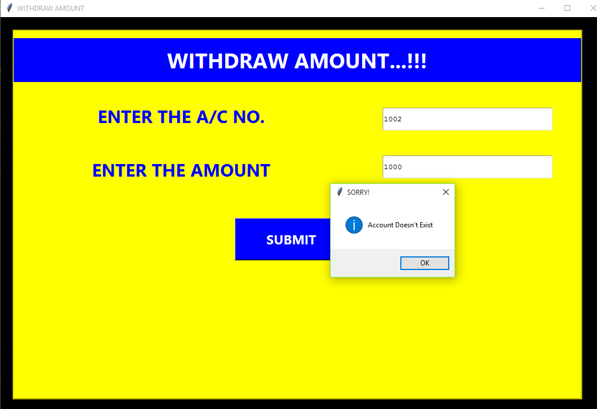
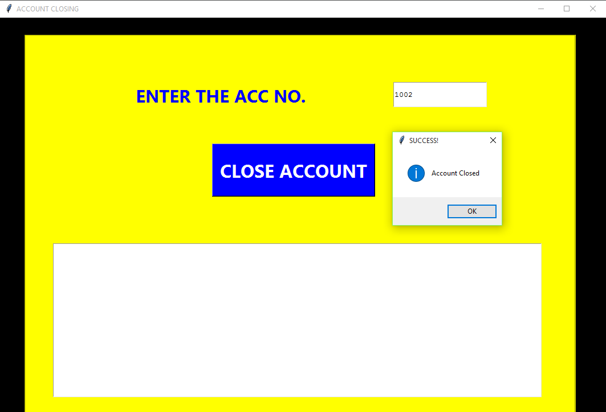

# BANK_MANAGEMENT-SYSTEM
A simple GUI-based Banking Management Model in Python.

## 🧐 Operations :
```bash
A User can perform following operations :
```
- create new account
- deposit amount
- withdraw amount
- enquiry (get account details)
- see all accounts

## 💻 Built with
- Python 
- Tkinter : for GUI 
- SQLite3 : for database connectivity

<h3>Screenshots</h3>

<div class="row">
      
           
      
</div>

<div class="row">
      
      
      
</div>

<div class="row">
      
      
      
</div>
